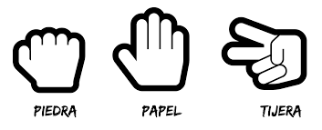

 Este proyecto ha sido creado en el programa **"Visual Code"** en el formato **"Jupyter Notebook"** y ha sido subido a un repositorio del programa GitHub; En este archivo readme encontraras como utilizar los diferentes juegos creados.

>Para poder ejecutar este programa:
   >-  Descargar Visual Code
  > -  Clonar repositorio
    

#### Este proyecto consiste en una colección de tres juegos clásicos de consola, implementados en Jupyter Notebook.
#### El propósito de este trabajo es crear una experiencia interactiva y divertida que permita a los jugadores disfrutar de juegos tradicionales mediante la programación.
#### Los juegos incluidos en este proyecto son:

- **Juego de Preguntas y Respuestas**: Un juego interactivo basado en preguntas sobre las capitales de Europa. El objetivo es responder correctamente tantas preguntas como sea posible.
- **Juego del Ahorcado**: Un divertido reto de adivinanza de palabras, donde un jugador tiene que adivinar una palabra secreta antes de quedarse sin intentos.
- **Piedra, Papel o Tijera**: Un clásico juego de dos jugadores, donde cada jugador elige entre piedra, papel o tijera, y el resultado depende de las combinaciones.

# Estructura del Proyecto

Este proyecto está dividido en tres archivos principales, cada uno dedicado a un juego específico:

- **piedra_papel_o_tijera.ipynb**: Implementación del juego Piedra, Papel o Tijera.
- **ahorcado.ipynb**: Implementación del juego del Ahorcado.
- **preguntas y respuestas.ipynb**: Implementación del juego de preguntas y respuestas basado en las capitales europeas.
Cada juego se ejecuta en la terminal y ofrece una interfaz sencilla para que los jugadores puedan disfrutar de la experiencia.

# Preguntas y Respuestas

Ejecuta el archivo: preguntas y respuestas.ipynb.
El juego te hará una serie de preguntas sobre las capitales de países europeos.
Tendrás varias opciones para cada pregunta, y solo una respuesta será correcta.
Al final del juego, recibirás un puntaje basado en las respuestas correctas.

# Piedra Papel & Tijera

Ejecuta el archivo: piedra_papel_tijera.ipynb.
El juego te pedirá que elijas entre "Piedra", "Papel" o "Tijera".
Después, la computadora hará su elección y te mostrará el resultado (quién ganó o si hubo empate).
El juego continuará pidiendo nuevas elecciones hasta que decidas terminar.

# Ahorcado

Ejecuta el archivo: ahorcado.ipynb.
Se seleccionará una palabra aleatoria y tendrás que adivinarla, letra por letra.
Cada vez que ingreses una letra incorrecta, se irá dibujando una parte de un muñeco (un "ahorcado").
El objetivo es adivinar la palabra antes de que el muñeco sea completado.

### Conclusión
Este proyecto es una forma entretenida de disfrutar de varios juegos clásicos mientras se practica programación en Python. Cada uno de los juegos, ya sea el tradicional Piedra, Papel o Tijera, el desafiante Ahorcado, o el educativo juego de Preguntas y Respuestas sobre capitales europeas, ofrece una experiencia interactiva y fácil de jugar en la terminal. Además, es una excelente base para que los desarrolladores novatos practiquen y amplíen sus habilidades en programación, añadiendo nuevas funcionalidades o mejorando la interfaz. 
>**¡Espero que disfruten del proyecto y encuentren oportunidades para aprender y mejorar!**

## **Sobre nuestro grupo**
Somos un equipo comprometido con el aprendizaje y el desarrollo de soluciones creativas en programación. Este repositorio es un espacio colaborativo donde hemos plasmado nuestras ideas y avanzamos juntas hacia el éxito.  

>**"El talento gana juegos, pero el trabajo en equipo y la inteligencia ganan campeonatos." – Michael Jordan**

¡Sigamos aprendiendo, creciendo y apoyándonos mutuamente en este emocionante camino! 

## **Integrantes del equipo**
- **Elena Alique Baumann**  
- **Antonia Aguiar Gordillo**  
- **Rosa Cardoso Gomes**  
- **Neyde Gabriela Fernández Meza**  
